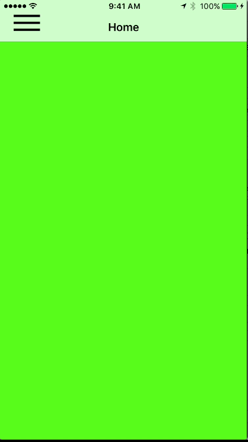
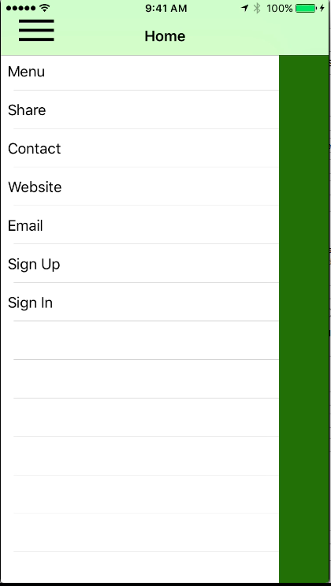

# Swipe-Menu-Samples
by
##### *Israel Manzo*

Technology used:
> Language
>> Swift 

> UIView Controller
>> Cocoa Touch
>>> UIView with animation 

> UITableView Controller
>> UITableView Cell

> UIGesture Recognizer
>> UIGesture Swipe Recognizer 

## First Sample Slide menu hard code
### Main menu(Simple view)

### Slide Menu showing 

